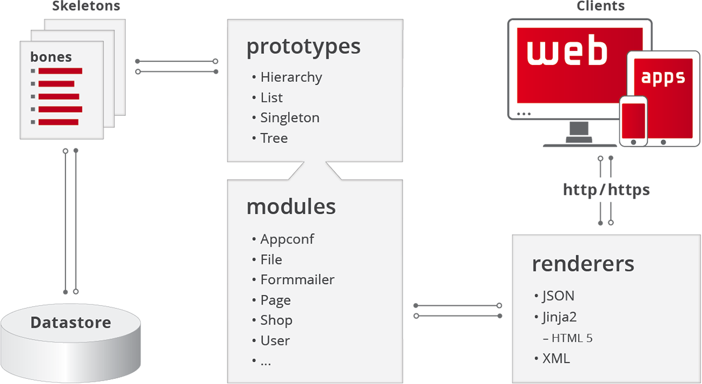

Basic concepts
##############

This part of the documentation targets to the basic architecture behind ViUR, and describes how the system is made up and how things work together.

Overview
========

On the first view, ViUR is a modern implementation of the traditional Model-View-Controller (MVC) design pattern. But ViUR is also much more. It helps to quickly implement new, even complex data models using pre-defined but highly customizable controllers and viewers.

The graphic above shows the different parts of the MVC-concept and their relation to each other.
Let's section these three parts of the MVC-concept and explain them in the terms of ViUR.

- In ViUR, the *models* are called **skeletons**.

  As seen from the biological point of view, a skeleton is a collection of bones. Therefore, the data fields in ViUR are called **bones**. Bones have different specialization and features, but more about that will follow soon.

- The *controllers* are called **modules**.

  They form a callable module of the application, which focuses a specific data kind or task.

  To implement modules, ViUR provides four generic *prototypes*: List, hierarchy, tree and singleton. There are many pre-built modules delivered with the ViUR server that implement e.g. a user-module, including login and registration logics, or a file-module, which is a tree (like a filesystem) to store files in the cloud.

- The *views* are called **renderers**.

  They render the output of the modules in a specific, clearly defined way. ViUR provides different renderers for different purposes. The jinja2-renderer, for example,  connects the Jinja template engine to ViUR, to emit HTML code for websites. The JSON-render serves as a REST-API and is used by several applications and tools communicating with the ViUR system, including the admin-tools.

These are the fundamental basics of the ViUR information system. It is now necessary to get deeper into these topics and arrange these three parts to get working results.

Folder structure
================

A typical ViUR application has a clearly defined folder structure.

This is the folder structure that is created by the setup.py utility as described in the :ref:`Getting started` section.

::

	project
	├── app.yaml
	├── cron.yaml
	├── project.py
	├── emails/
	├── html/
	├── index.yaml
	├── modules/
	├── server/
	├── skeletons/
	├── static/
	├── translations/
	└── vi/

The following tables gives some short information about each file/folder and their description.

=============   =================================================================================
File / folder   Description
=============   =================================================================================
app.yaml        This is the Google App Engine main configuration file for the application.

                It contains information about how to trigger the application, which folders are exposed in which way and which libraries are used.

cron.yaml       This is a Google App Engine cron tasks configuration file.

project.py      This Python script is the application's main entry. It is project-specific and normally the place where configuration parameters or specialized settings can be done.

                This file is automatically named after the project, and referred by app.yaml.

emails/         Template folder for emails. Not necessary for now.

html/           Template folder for the HTML-templates rendered by the Jinja2 template engine.

index.yaml      This is an (mostly) automatically managed configuration file for the Google datastore database describing compound indexes for several document kinds in the database. These indexes are required for querying data, but will also be discussed later.

modules/        This is the folder where the applications modules code remains.

                Usually, every module is separated into one single Python file here, but it can also be split or merged, depending on the implementation. Every module that should be made available to the system must be imported in the ``__init__.py`` in order to Pythons typical packaging logic.

server/         This is the ViUR server as downloaded from `<http://viur.is>`_.

                It serves as a library for the entire application and provides all requirements for the ViUR system.

                This folder can be updated to a newer server version without changing the behavior of the application, except it is necessary (please read the updating guidelines, if so).

skeletons/      Like the modules folder, this is the place where the skeletons for the data models are put.

                Usually, one Python file for every skeleton, but this is also only an advise. ``__init__.py`` must also be extended when new skeletons are created.

static/         This folder is used for static files that are served by the applications when providing a HTML-frontend. CSS, images, JavaScripts, meta-files and fonts are stored here.

translations/   When multi-language support is wanted, this folder contains simple Python files which hold the translation of static texts to be replaced by their particular language. Its not important for now.

vi/             Contains the Vi.

                This folder is *not* created by the setup utility, but exists if the Vi was downloaded and installed from `<http://viur.is>`_, or a demo project is used.

                Vi is an HTML5-based administration interface to access the ViUR system's modules and its data. The Vi is some kind of backend for ViUR, but it could also be the front-end of the application - this all depends on what the ViUR system implements in its particular application.
=============   =================================================================================

About skeletons and bones
=========================

Skeletons are the data models of a ViUR application.

They form an high-level abstraction layer that runs on top of the low-level database API served by ViUR, which again bases directly on `Google Datastore functions API <https://cloud.google.com/appengine/docs/python/datastore/api-overview>`_.

Skeletons are made of bones. A bone is the instance of a bone class and references to a data field in the resulting dataset. It performs data validity checks, serialization to and deserialization from the database and reading data from the clients.

Skeletons are derived from the class :class:`~server.skeleton.Skeleton`. They automatically provide the bone ``key``, which is an instance of the class :class:`~server.bones.bone.baseBone` and holds the value of the unique entity key. The pre-defined bones ``creationdate`` and ``changedate`` of each skeleton store the date and time when the dataset was created or changed.

By default, ViUR provides the following base classes of bones that can be immediately used:

- :class:`~server.bones.booleanBone.booleanBone` for ``bool`` values,
- :class:`~server.bones.dateBone.dateBone` for :class:`~datetime.date`, :class:`~datetime.time` and :class:`~datetime.datetime` values,
- :class:`~server.bones.numericBone.numericBone` for ``float`` and ``int`` values,
- :class:`~server.bones.relationalBone.relationalBone` to store a relation to other datastore objects with a full integration into ViUR,
- :class:`~server.bones.selectOneBone.selectOneBone` for fields that allow for a single-selection of key-value pairs,
- :class:`~server.bones.selectMultiBone.selectMultiBone` for fields that allow for a multi-selection of key-value pairs,
- :class:`~server.bones.stringBone.stringBone` for strings or list of strings,
- :class:`~server.bones.textBone.textBone` for HTML-formatted content.

There are also some more specialized, pre-defined bones that can be used. Please refer the :ref:`bones API reference <reference_bones>` for all provided classes and options.

About prototypes and modules
============================

Modules are the controllers of a ViUR application, and implement the application logic.

To implement modules, ViUR provides four basic prototypes. These are :class:`~server.prototypes.list.List`, :class:`~server.prototypes.singleton.Singleton`, :class:`~server.prototypes.hierarchy.Hierarchy` and :class:`~server.prototypes.tree.Tree`.

- The most commonly used prototype is the :class:`~server.prototypes.list.List`. It implement a flat collection of datasets of the same kind, which can be granulated using filters to particular selections. This prototype is used in most cases, and can be seen like a database table in a relational database management system.
- :class:`~server.prototypes.singleton.Singleton` is a prototype for implementing modules that hold only one single dataset entry. It can be used for modules that allow for application-global settings or configurations.
- :class:`~server.prototypes.hierarchy.Hierarchy` is a prototype for a module that stores its data in a hierarchical structure, where every dataset can be a child of another dataset or can have its own children.
- In addition, the :class:`~server.prototypes.tree.Tree` prototype is for implementing modules that store their data in a hierarchy, but differ between nodes and children. The most common usage is the :class:`~server.modules.file.File` module, where nodes and leafs are distinguished.

ViUR comes with some build-in modules for different application cases:

- :class:`~server.modules.file.File` implements a file management module
- :class:`~server.modules.user.User` implements a user login, authentication and management module,
- :class:`~server.modules.cart.Cart` and :class:`~server.modules.order.Order` implement modules for submitting and managing orders in a web-shop,
- :class:`~server.modules.page.Page` implements a simple content management module.

By subclassing these modules, custom modifications and extensions can be implemented for any use-case. In most cases, applications make use of custom modules which base on one of the prototypes as described above.

About the renderers
===================

todo

